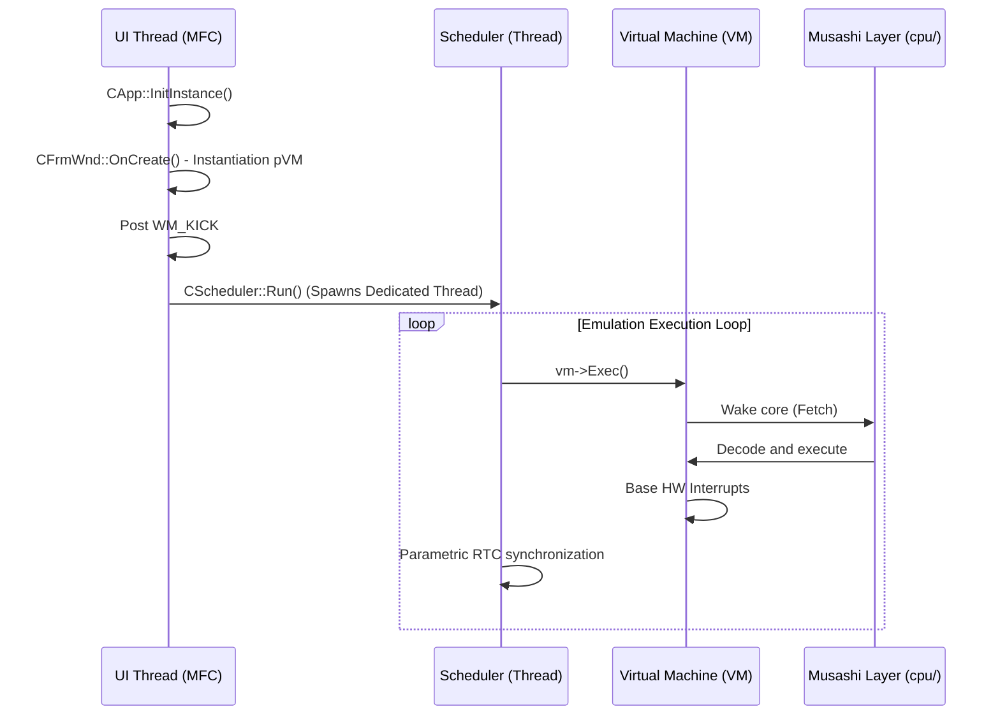

# XM6 - X68000 Emulator (XM62026 Multiplatform Branch)

## Source Code
**Original Copyright (C) 2001-2006 Ytanaka**
*Refactored and Expanded for Modern Architecture and Multiplatform Support (Libretro)*

---

## About Source Code Release and Project Evolution

This file contains the documented source code of the XM6 X68000 emulator. Its original heritage from version 2.06 (2006) represented a qualitative leap by opening its distribution, but it came tightly coupled to restrictive ecosystems such as pure Win32 and anachronistic compilers from the Visual C++ 6.0 era.

**Current Evolution (XM62026):**
The emulator's architecture has overcome its exclusive dependency on native Windows subsystems. A comprehensive modular redesign was executed on its interfaces, resulting in the bifurcated generation of binaries: it is viable to compile traditional *Standalone* executables for desktop, but equally robust is the synthesis of the new dynamic core, rigidly coupled to the multiplatform standard defined by the **Libretro** API (as a core for RetroArch or equivalents).

Alongside this, its theoretical AV virtues were diametrically expanded: filters were isolated into independent directories to manipulate the resulting VRAM pixels, and a restructuring of the strict FM acoustic sampling pipeline was forced, eliminating the dependency on relaxed buffers and requiring a collision-free *streaming* to adapt to the strict iterative cycle of the external frontend.

It is expected that this open source code faithfully alludes to the remaining technical documentation governing the Sharp X68000, successfully adapted from retro logic to pragmatic architectures.

---

## Terms of Use (License)

Regarding the files included in the entire repository, with the exception of the explicit adapted libraries referenced below, the copyright persists unaltered, belonging to Ytanaka.

When reusing part or all of the source files, these rules must be followed in order:

- When reusing isolated core files in `vm/`, it is strictly required to indicate the copyright notice and the original heritage on their derivative documentation files. Their use for entirely profit-driven or obvious commercial purposes **is strictly denied**.
- The reuse of the rest of the operational frameworks is exempt from impositions additional to the generic prohibition for purely commercial purposes.

> **The redistribution, hidden compilation, or packaging of this fundamental repository to violate private prerogatives of third parties is not allowed.**

### Exceptions to Third Parties
Functional elements embedded to assist direct emulations:
*   Pure MPU emulator module **Musashi** Motorola 68000 (rights explicitly tied to Karl Stenerud and contributors to the Musashi / MAME project).
*   Virtual wrapper and sound timer of the **fmgen** synthesis project (rights explicitly tied to cisc).
*   Sound synthesis core **X68Sound** (rights explicitly tied to m_u_g_e_n).
*   Yamaha FM oscillator emulation **ymfm** (rights explicitly tied to Aaron Giles).
*   Native I/O bridging abstraction of **windrv** (rights assimilated as an investigative contribution explicitly tied to co).

*(Architectural Note: The old dynamic compiler Starscream in x86 assembly has been formally replaced by the multiplatform Musashi engine, rendering it materially obsolete in the current repository).*

---

## Modern Development and Build Environment

The old guidelines linked to forcefully manipulating restrictive or dependent files like `XM6.dsw` or `00vcproj.vc6` were abolished. The entire workflow has shifted to operations unified through the Terminal and orchestrated by automatable batches (Batch Scripts).

**Modern Build Routines:**
To integrate the base solution, it is indispensable to execute the process using logical scripts exposed to the user to dispatch the parametric compiler (`msbuild`) and analogous utilities:

-   **`build32.bat`**: Main sequence for the compilation and linking target formally focused on conventional x86 architectures and systems.
-   **`build64.bat`**: Identical routine migrated explicitly to output an optimal performance binary targeted for AMD64 / IA-64 bit *targets*, minimizing erroneous data conversions at runtime.
-   **`main\buildvs.bat`**: Master script in charge of initializing the native environment stack of the base libraries (e.g.: seizing the C++ toolchain via *vcvars32.bat* within the Visual Studio ecosystem) provided in the neuralgic `main/` directory.

*(The receiving folders and derivative outputs of clean binaries will operate organically, emptying their content into dynamically generated sub-spaces such as `build_win32\`, `build_win64\` or allocating themselves dynamically on the root).*

---

## Directory Structure (Expanded Multilayer Architecture)

The archaic explicit bifurcation between abstract virtualization and pure Microsoft windows was subverted by an architectural segmentation plane of responsibilities:

| Exposed Directory | Content and Modular Responsibility |
|---|---|
| `cpu/` | Houses the MPU core **Musashi** for Motorola 68K. Isolates generic C routines, purifying the system of the asymmetrical conditional assembly of the past. |
| `vm/` | Maintains the intrinsic virtual machine faithful and intact: Memory controllers, abstract CRTC, DMA chips, real-time clocks (RTC), and base device gearing. |
| `libretro/` | **NEW:** Absolute multiplatform transition. Specialized module programmed to export every visualization abstraction to the open retro-c standard, injecting an agnostic core invokable by master clients (RetroArch). |
| `mfc/` | Original native base layer. Provides the necessary primitives to settle the window on the desktop in strict Win32 domains. |
| `main/` | Central driving environment that wraps the global execution and houses the startup logic (*entry points*). |
| `shaders/` | **NEW:** Dedicated separate visual tool. Incorporates dependencies aimed at scaling and matrix pixel processing outside the limiting GDI rigor. |
| `res/` | Integral directory managed to contain cross-localizations visualizing a **simultaneous iterative support for 3 languages**, dispensing with the strict and inflexible bilingualism of yesteryear. |

---

## Source Code Guide and Operation Flow

The VM exposes a purely logical anatomy made up of base Classes like `Device` and `MemDevice`. However, the host-guest interaction and the perimeter flows analytically differ depending on the linked compiler:

### 1. The Captive Loop: Standalone Route (MFC WIN32)
Retains the topology and logical encapsulation governed by the CComponent library; through coupled inheritances in doubly linked lists, the `CFrmWnd` dispatches events and commands orchestrated in the message maps. The emulated life cycle consists of the following steps:
*   **Initialization (`InitInstance` / `Init`):** The *host* is validated, detecting CPU extensions and forging the visual environment.
*   **Virtual HW Gestation (`CFrmWnd::OnCreate`):** Rigid instantiation of the predefined general pointer `pVM`, tying the peripherals to the host (Keyboard, *Wave Out*, V-Sync).
*   **Synchronous Critical Point (`WM_KICK` / `CScheduler::Run`):** Upon completing gestation, a messenger pulse between windows triggers the formal instantiation of a new underlying dedicated *Thread* (Windows thread) exclusively and repeatedly meant to press the `vm->Exec()` invocation.

### 2. The Dynamic Loop: Multiplatform Route (Libretro)
Absolutely subverts any concurrent inheritance delegated by dependent libraries alien to the core.
*   **Transactional Invocation (`retro_run`):** Instead of opening an isolated thread for the logical heart to run indefinitely, the main orchestrator retains advance control by delegating execution over block-by-block *Callbacks* requests.
*   Advances the arithmetic calculation by analyzing it mathematically and standardized in fixed symmetrical margins (frame by frame). The VM computes an exact slice of *virtual time* until equalizing the dictated VBLANK pulse ratio or an exact margin of demanded sound samples.

Both bifurcations persist validated by the unified universal module. This modernized environment dissolves conceptual limitations to erect itself once again as a standard of strict preservation and code of excellence for modern methodologies.
