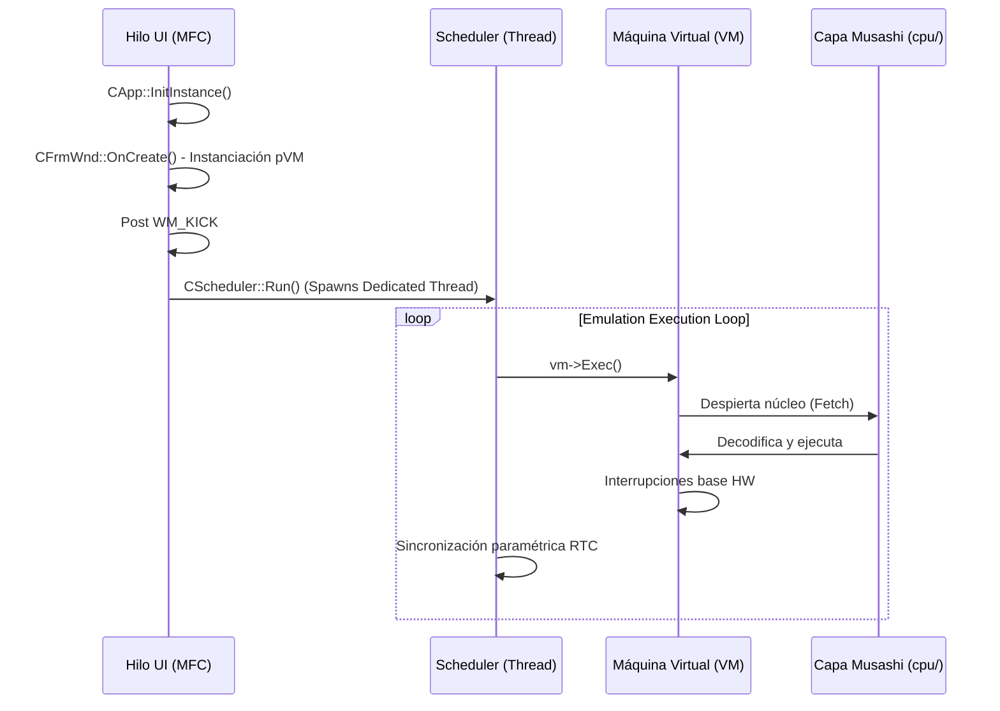

# XM6 - Emulador X68000 (Rama XM62026 Multiplataforma)

## Código fuente
**Copyright Original (C) 2001-2006 Ytanaka**
*Refactorizado y Expandido para Arquitectura Moderna y Soporte Multiplataforma (Libretro)*

---

## Sobre la publicación del código fuente y Evolución del Proyecto

Este archivo contiene el código fuente documentado del emulador de X68000 XM6. Su herencia original de la versión 2.06 (2006) representaba un salto cualitativo al abrir su distribución, pero venía fuertemente acoplada a ecosistemas restrictivos como Win32 puro y compiladores anacrónicos de la era de Visual C++ 6.0.

**Evolución Actual (XM62026):**
La arquitectura del emulador ha superado su dependencia exclusiva de subsistemas de Windows nativo. Se ejecutó un rediseño modular íntegro en sus interfaces logrando como resultado la generación bifurcada de binarios: es viable compilar ejecutables *Standalone* tradicionales para escritorio, pero igualmente robusta resulta la síntesis del nuevo núcleo dinámico, acoplado rígidamente al estándar multiplataforma definido por la API de **Libretro** (como núcleo para RetroArch o equivalentes).

Conjunto a ello, se expandieron diametralmente sus virtudes teóricas de AV: se aislaron filtros sobre directorios independientes para manipular los pixeles resultantes de la VRAM y se forzó una restructuración del estricto pipeline de muestreos acústicos FM, suprimiendo la dependencia a buffers relajados y requiriendo un *streaming* libre de colisiones para amoldarse al ciclo estricto iterativo del frontend ajeno.

Se espera que este código fuente abierto aluda fielmente a la documentación técnica remanente que rige al Sharp X68000, adaptado exitosamente de lógicas retro a arquitecturas pragmáticas.

---

## Condiciones de uso (Licencia)

Sobre los archivos incluidos en el repositorio íntegro, a excepción de las librerías adaptadas explícitas referidas más adelante, los derechos de autor persisten inalterables perteneciendo a Ytanaka.

Cuando se reutilice parte o la totalidad de los archivos fuente, deberán seguirse ordenadamente estas reglas:

- Al reutilizar archivos núcleo aislados en `vm/`, se requiere indefectiblemente indicar el aviso de derechos de autor y la herencia original sobre sus archivos de documentación derivados. Su utilización con fines íntegramente de lucro u obvia naturaleza comercial **está estrictamente denegado**.
- La reutilización del resto de marcos operacionales es exenta de imposiciones adicionales a la prohibición genérica para fines meramente comerciales.

> **No está permitida la redistribución, compilación oculta o empaquetado de este repositorio fundamental para violar prerrogativas privativas de terceros.**

### Excepciones a terceros
Elementos funcionales empotrados para asistir emulaciones directas:
*   Módulo emulador puro de procesador **Musashi** Motorola 68000 (derechos atados explícitamente a Karl Stenerud y colaboradores del proyecto Musashi / MAME).
*   Wrapper virtual y temporizador sonoro del proyecto de síntesis **fmgen** (derechos atados explícitamente a cisc).
*   Núcleo de síntesis sonora **X68Sound** (derechos atados explícitamente a m_u_g_e_n).
*   Emulación de oscilador Yamaha FM **ymfm** (derechos atados explícitamente a Aaron Giles).
*   Abstracción nativa de puenteo I/O de **windrv** (derechos asimilados como aporte investigativo atados explícitamente a co).

*(Nota Arquitectónica: El antiguo compilador dinámico Starscream en ensamblador x86 ha sido formalmente reemplazado por el motor multiplataforma Musashi, dictaminando su obsolescencia material en el actual repositorio).*

---

## Entorno de Desarrollo y Construcción Moderna

Las directrices antiguas vinculadas a manipular forzosamente archivos restrictivos o dependientes como `XM6.dsw` o `00vcproj.vc6` resultaron suprimidas. Todo el flujo ha girado a operaciones unificables por Terminal y orquestadas por lotes automatizables (Scripts Batch).

**Rutinas Modernas de Construcción:**
Para integrar la solución base, es indispensable ejecutar el proceso por medio de scripts lógicos expuestos al usuario para despachar el compilador paramétrico (`msbuild`) y utilerías análogas:

-   **`build32.bat`**: Secuencia principal para el objetivo de compilación y enlace enfocado formalmente en arquitecturas y sistemas x86 convencionales.
-   **`build64.bat`**: Rutina idéntica migrada explícitamente para emitir un binario óptimo de desempeño apuntado a *targets* AMD64 / IA-64 bits, minimizando conversiones de datos erróneas en tiempo de ejecución.
-   **`main\buildvs.bat`**: Script matriz encargado de inicializar el stack de entorno nativo de las librerías base (ej: acaparando el toolchain C++ por medio de *vcvars32.bat* dentro del ecosistema Visual Studio) facilitado en el directorio neurálgico `main/`.

*(Las carpetas receptoras y salidas derivadas de binarios limpios operarán orgánicamente desembocando su contenido dentro de sub-espacios generados del estilo `build_win32\`, `build_win64\` o alocándose dinámicamente sobre la raíz)*.

---

## Estructura de Directorios (Arquitectura Multicapa Expandida)

La arcaica bifurcación explicita entre la virtualización abstracta y las ventanas puras de Microsoft resultó subvertida por un plano de segmentación arquitectural de responsabilidades:

| Directorio Expuesto | Contenido y Responsabilidad Modular |
|---|---|
| `cpu/` | Aloja el núcleo lógico de MPU **Musashi** de Motorola 68K. Aisla las rutinas C genéricas purificando al sistema del ensamblador condicional asimétrico del pasado. |
| `vm/` | Mantiene fiel e intacta la máquina virtual intrínseca: Controladores de memoria, CRTC abstracto, chips DMA, relojes de tiempo real (RTC) y engranaje de dispositivos base. |
| `libretro/` | **NUEVO:** Transición multiplataforma absoluta. Módulo especializado programado para exportar toda abstracción de visualización al estándar abierto retro-c, inyectando un núcleo agnóstico invocable por clientes maestros (RetroArch). |
| `mfc/` | Capa base original nativa. Provee de las primitivas necesarias para asentar la ventana a escritorio en dominios estrictos Win32. |
| `main/` | Entorno conductor central que envuelve la ejecución global y aloja las lógicas de arranque (*entry points*). |
| `shaders/` | **NUEVO:** Herramienta visual separada ex profeso. Incorpora dependencias destinadas al escalado y tratamiento matricial de pixeles fuera del rigor limitante GDI. |
| `res/` | Directorio integral gestionado para contener localizaciones cruzadas visualizando un **soporte iterativo simultáneo para 3 idiomas**, prescindiendo del bilingüismo estricto e inflexible de antaño. |

---

## Guía del Código Fuente y Flujo de Operación

La VM expone una anatomía puramente lógica conformada por Clases base como `Device` y `MemDevice`. Sin embargo, la interacción host-guest y los flujos perimetrales discrepan analíticamente según el compilador eslabonado:

### 1. El Bucle Cautivo: Ruta Standalone (MFC WIN32)
Retiene la topología y encapsulación lógica regida por la librería CComponent; mediante herencias acopladas en listas doble enlazadas, el `CFrmWnd` despacha eventos y comandos orquestados en los message maps. El ciclo de vida emulado consta de los siguientes peldaños:
*   **Inicialización (`InitInstance` / `Init`):** Se valida el *host*, detectando extensiones CPU y forjando el entorno visual.
*   **Gestación del HW Virtual (`CFrmWnd::OnCreate`):** Instanciamiento rígido del puntero general predefinido `pVM`, anudando los periféricos al host (Teclado, *Wave Out*, V-Sync).
*   **Punto Crítico Sincrónico (`WM_KICK` / `CScheduler::Run`):** Al finalizar la gestación, un pulso mensajero entre ventanas desencadena la instanciación formal de un nuevo *Thread* (hilo de Windows) subyacente dedicado exclusiva y repetitivamente a presionar la invocación `vm->Exec()`.

### 2. El Bucle Dinámico: Ruta Multiplataforma (Libretro)
Subvierte en absoluto cualquier herencia concurrente delegada por librerías dependientes ajenas al core.
*   **Invocación Transaccional (`retro_run`):** En lugar de abrir un hilo asilado para el corazón lógico que corra al infinito, el orquestador principal retiene el control de avance delegando la ejecución sobre peticiones *Callbacks* bloque a bloque.
*   Avanza el cálculo aritmético analizando de forma matemática y estandarizada en márgenes simétricos fijos (cuadro por cuadro). La VM computa una rodaja de *tiempo virtual* exacta hasta igualal el ratio del pulso VBLANK dictaminado o un margen exacto de muestras de sonido demandadas.

Ambas bifurcaciones persisten validadas por el módulo universal unificado. Este entorno modernizado disuelve limitaciones conceptuales para erigirse nuevamente como un estándar de preservación estricta y código de excelencia para las metodologías modernas.
